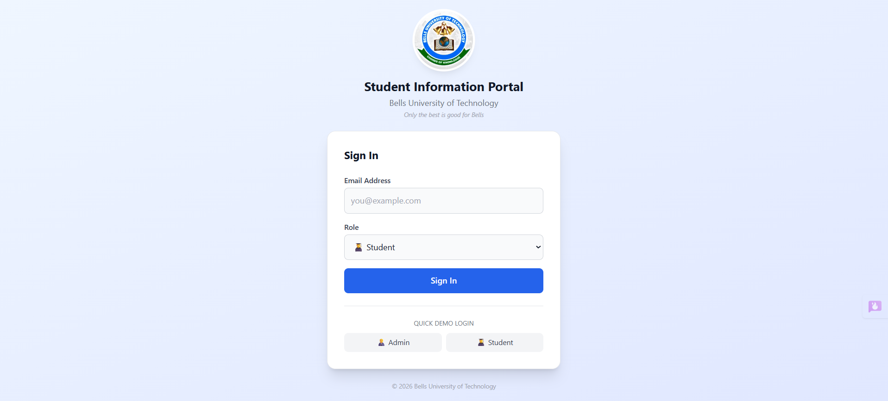
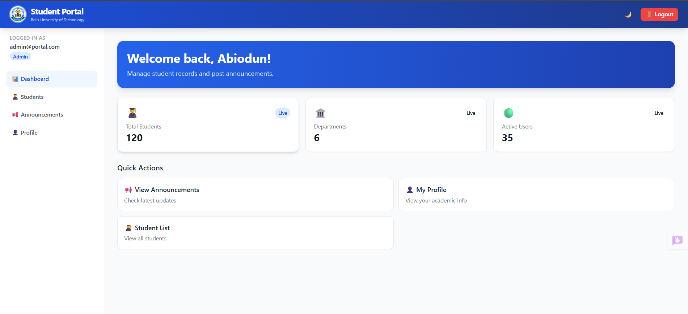
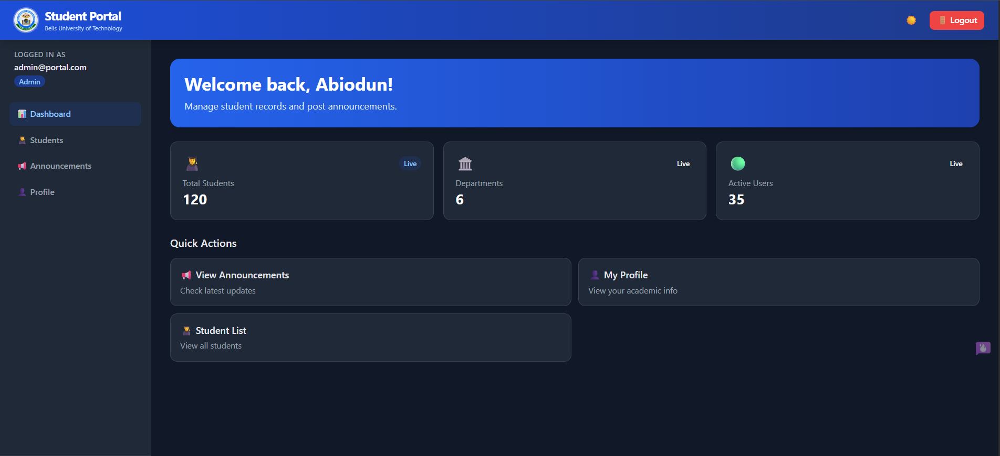
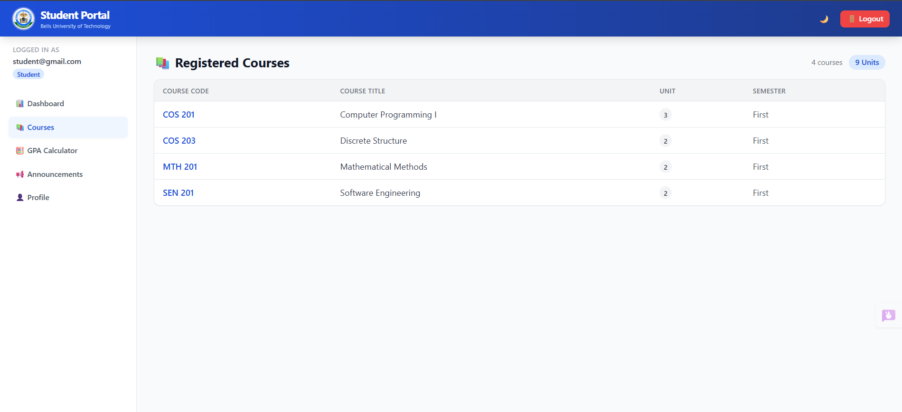
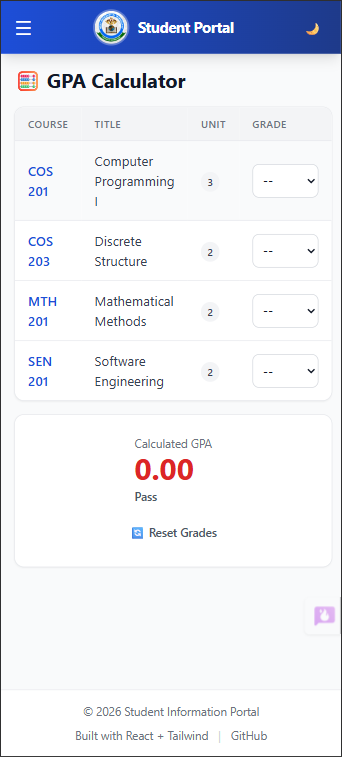
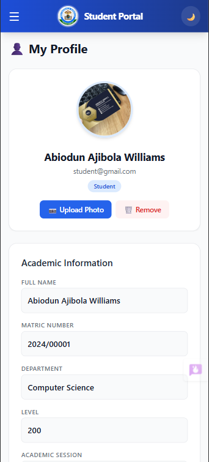
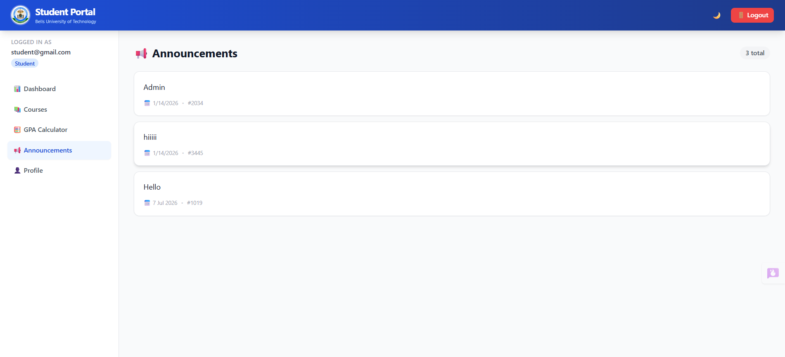
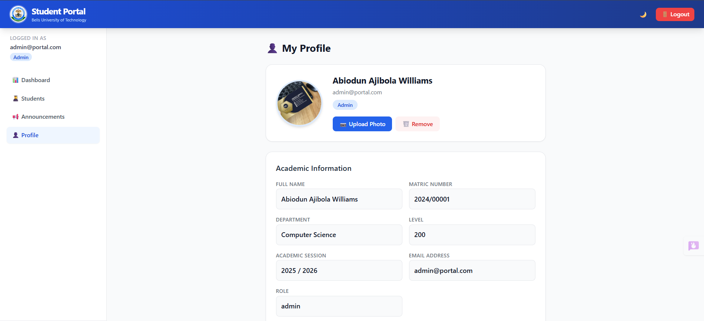

# 🎓 Student Information Portal

A responsive, role-based academic portal built with **React**, **Tailwind CSS**, and **Vite**. Designed for university students and administrators to manage courses, calculate GPA, post announcements, and view academic profiles.

> 🏫 Developed as a 200-level Frontend Software Development project at **Bells University of Technology**.

---

## 🌐 Live Demo

🔗 **[View Live Site](https://nicowillyx.github.io/student-information-portal)**

---

## ✨ Features

### 🔐 Authentication & Role Separation
- **Login system** with role-based access control (Admin / Student)
- **Quick demo login** — one-click access as Admin or Student
- **Session persistence** — stays logged in across page refreshes

### 📊 Dashboard
- Personalized welcome banner
- Live statistics cards (students, departments, active users)
- **Quick action shortcuts** tailored to your role

### 👨‍🎓 Student Features
- 📚 **View registered courses** with credit units and semester info
- 🧮 **GPA Calculator** with real-time computation and grade classification
- 📢 **View announcements** posted by administrators
- 👤 **View profile** with academic details and photo upload

### 🧑‍💼 Admin Features
- 👨‍🎓 **Student directory** with search/filter by name or matric number
- 📢 **Post announcements** with character limit and delete capability
- 📊 **Admin dashboard** overview

### 🎨 UI/UX
- 🌗 **Dark mode toggle** with system preference detection and localStorage persistence
- 📱 **Fully responsive** — mobile hamburger menu, collapsible sidebar, adaptive tables
- ✨ **Smooth transitions** and hover effects throughout
- 🎯 **Active page indicators** in navigation

---

## 🛠️ Tech Stack

| Technology | Purpose |
|------------|---------|
| [React 19](https://react.dev) | UI library |
| [Vite 7](https://vitejs.dev) | Build tool & dev server |
| [Tailwind CSS 3](https://tailwindcss.com) | Utility-first styling |
| [React Context API](https://react.dev/reference/react/useContext) | Global state management |
| Browser LocalStorage | Data persistence (auth, theme, announcements, profile photo) |
| [GitHub Pages](https://pages.github.com) | Deployment |

---

## 📂 Project Structure

```
student-information-portal/
│
├── dist/                      # Production build output
│   └── assets/                # Compiled JS/CSS files
│
├── docs/                      # Documentation & screenshots
│   └── screenshots/           # App screenshots for README
│
├── node_modules/              # Dependencies (auto-generated)
│
├── public/                    # Static assets
│   └── vite.svg               # Vite logo
│
├── src/                       # Source code
│   ├── assets/                # Images & static files
│   │   └── react.svg
│   │
│   ├── components/            # Reusable UI components
│   │   ├── Footer.jsx         # Footer with credits
│   │   ├── Navbar.jsx         # Top nav + mobile menu + theme toggle + Bells logo
│   │   └── Sidebar.jsx        # Desktop nav + user info + logout
│   │
│   ├── context/               # Global state providers
│   │   ├── AnnouncementContext.jsx   # CRUD for announcements
│   │   ├── AuthContext.jsx           # Login/logout + user state + persistence
│   │   └── ThemeContext.jsx          # Dark/light mode toggle
│   │
│   ├── data/                  # Static data files
│   │   └── courses.js         # Course list with units & semesters
│   │
│   ├── pages/                 # Route-level page components
│   │   ├── Announcements.jsx  # Announcement board (admin post / student view)
│   │   ├── Courses.jsx        # Registered courses table (student)
│   │   ├── Dashboard.jsx      # Landing overview with stats & quick actions
│   │   ├── GPA.jsx            # Interactive GPA calculator (student)
│   │   ├── Login.jsx          # Auth screen with Bells logo & demo login
│   │   ├── Profile.jsx        # User profile + photo upload
│   │   └── Students.jsx       # Student directory with search (admin)
│   │
│   ├── App.jsx                # Root component + page routing logic
│   ├── index.css              # Tailwind directives + base styles
│   └── main.jsx               # Entry point + context providers wrapping
│
├── .gitignore                 # Git ignore rules
├── eslint.config.js           # ESLint configuration
├── index.html                 # HTML entry point
├── package-lock.json          # Dependency lock file
├── package.json               # Dependencies & scripts
├── postcss.config.js          # PostCSS config (Tailwind + Autoprefixer)
├── README.md                  # This file
├── tailwind.config.js         # Tailwind config (darkMode: class)
└── vite.config.js             # Vite config (base path for GitHub Pages)
```

---

## 🚀 Getting Started

### Prerequisites
- [Node.js](https://nodejs.org) (v18+)
- npm or yarn

### Installation

```bash
# 1. Clone the repository
git clone https://github.com/Nicowillyx/student-information-portal.git

# 2. Navigate into the project
cd student-information-portal

# 3. Install dependencies
npm install

# 4. Start the development server
npm run dev
```

The app will be available at `http://localhost:5173`

---

## 📦 Build & Deploy

```bash
# Build for production
npm run build

# Deploy to GitHub Pages
npm run deploy
```

> The `base` path in `vite.config.js` is already configured for GitHub Pages deployment.

---

## 🔑 Demo Credentials

| Role | Email | How to Access |
|------|-------|---------------|
| **Admin** | `admin@portal.com` | Click "🧑‍💼 Admin" quick login button |
| **Student** | `student@gmail.com` | Click "👨‍🎓 Student" quick login button |

> No password required — this is a frontend-only demo with simulated authentication.

---

## 🖼️ Screenshots

### Login Page

(docs/screenshots/Mobile login page.png)
*Clean login screen with quick demo access buttons*

### Dashboard

(docs/screenshots/Mobile admin dashbord.png)
(docs/screenshots/Desktop student dashbord.png)
*Personalized welcome banner with stats and quick actions*

### Dark Mode

(docs/screenshots/Mobile admin dashbord dark.png)
(docs/screenshots/Mobile student course page dark.png)
(docs/screenshots/Desktop student GPA calculator dark.png)
(docs/screenshots/Mobile student announcement dark.png)
(docs/screenshots/Desktop student profile dark.png)
*Fully implemented dark theme with system preference detection*

### Course Page



### GPA Calculator

*Interactive GPA calculator with real-time grade classification*

### Mobile View

(docs/screenshots/Mobile admin profile.png)
*Responsive mobile navigation with hamburger menu*

### Announcement Page


### Profile



---

## 🧠 What I Learned

This project was a deep dive into modern frontend development practices:

- **React Context API** — Managing global state (auth, theme, announcements) without external libraries like Redux
- **Component Architecture** — Separating concerns into reusable components, pages, and context providers
- **Responsive Design** — Using Tailwind CSS breakpoints (`sm:`, `md:`, `lg:`) to create mobile-first layouts
- **Dark Mode Implementation** — Leveraging Tailwind's `darkMode: "class"` strategy with `localStorage` persistence
- **File Handling** — Using `FileReader` API for client-side image upload and base64 conversion
- **State Management Patterns** — Functional updates to avoid stale closures, lazy initialization from `localStorage`
- **Accessibility** — Semantic HTML, ARIA labels, keyboard navigation, and focus management
- **Deployment** — Configuring Vite for GitHub Pages with correct `base` paths

---

## ⚠️ Limitations & Future Improvements

### Current Limitations
- **No backend** — All data is stored in browser `localStorage`
- **Simulated authentication** — No real password validation or JWT tokens
- **Static data** — Student records and courses are hardcoded
- **No real-time updates** — Announcements don't sync across devices

### Planned Improvements
- [ ] Integrate a real backend (Node.js + Express + MongoDB or Firebase)
- [ ] Implement JWT-based authentication with password hashing
- [ ] Add course registration and enrollment features
- [ ] Export GPA results as PDF transcripts
- [ ] Admin analytics dashboard with charts
- [ ] Email notifications for new announcements
- [ ] Multi-department support with dynamic filtering

---

## 👨‍💻 Author

**Abiodun Ajibola Williams**

- 🎓 Computer Science, Bells University of Technology
- 💼 Fullstack Developer (React / Node.js)
- 🐙 [GitHub](https://github.com/Nicowillyx)
- 💼 [LinkedIn](https://linkedin.com/in/my-profile) *(update this)*

---

## 📜 License

This project was developed for **academic purposes** as part of a university coursework requirement.

Feel free to fork, study, and build upon it — but please give credit if you use significant portions of the code.

---

<p align="center">
  Built with ❤️ using React + Tailwind CSS + Vite
</p>
